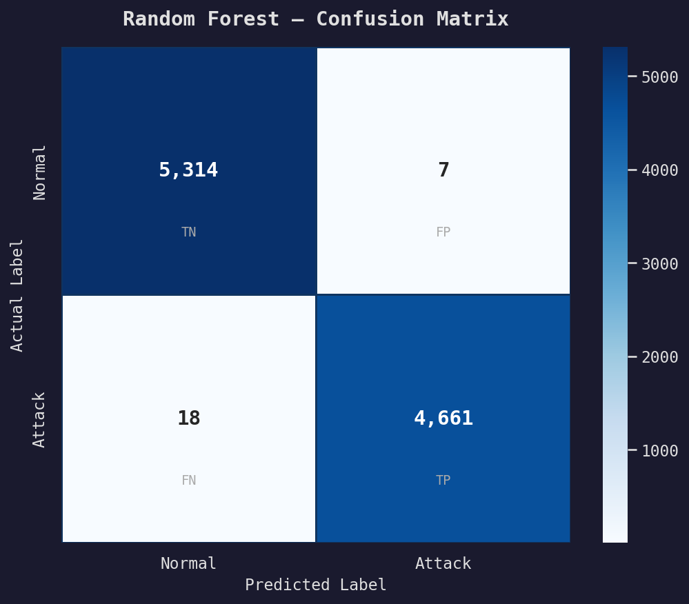
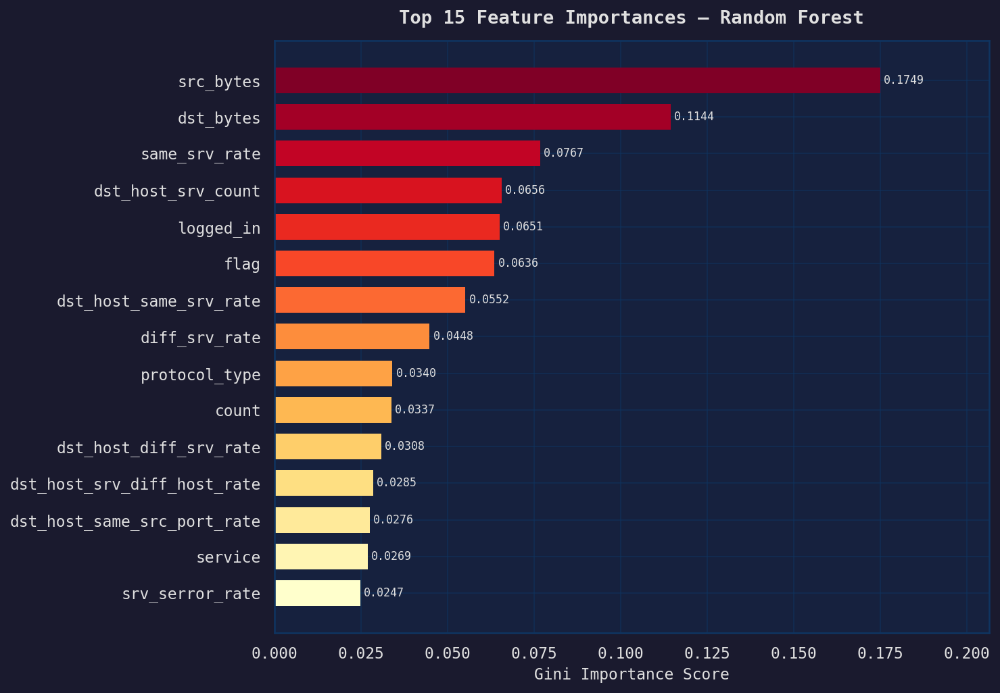
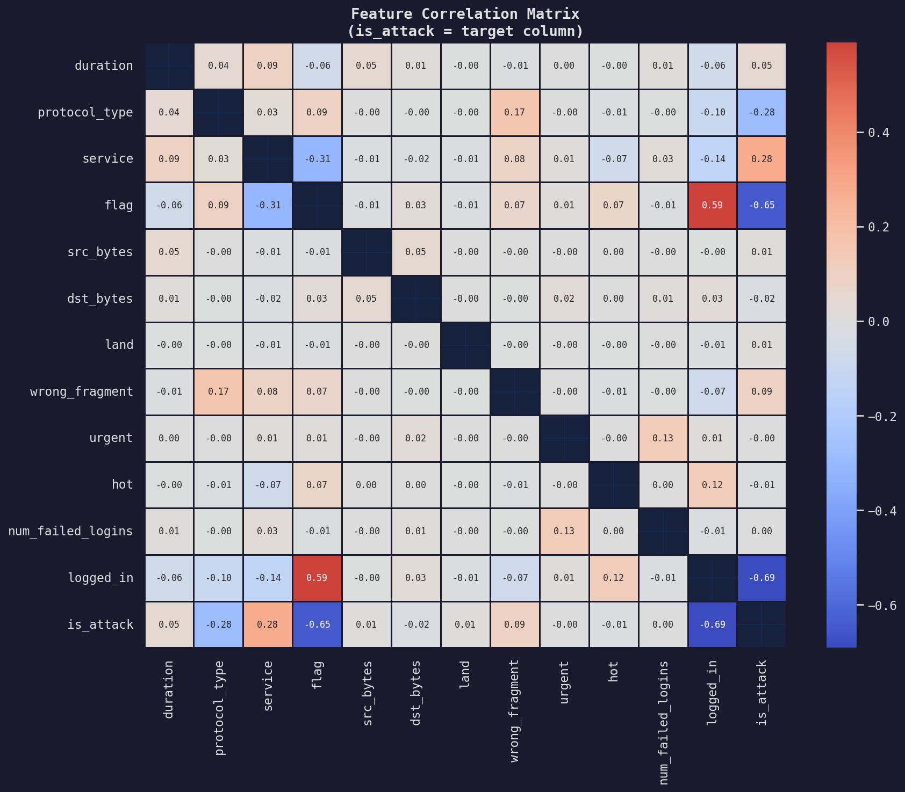

# AI-Powered Cybersecurity Threat Detection 🛡️

An enterprise-grade, end-to-end Machine Learning pipeline designed to detect network intrusions and zero-day cyber attacks. 

This system employs a dual-model architecture analyzing live network connection data. It seamlessly shifts from catching known historical attacks with pinpoint accuracy to flagging entirely new, anomalous behaviors that evade traditional rules-based firewalls.

---

## 🧠 Dual-Model Architecture

Cybersecurity operates in an environment of constant structural change. Relying purely on supervised learning guarantees vulnerability to Zero-Day attacks. To counteract this, our detection engine is split into two specialized AI components:

### 1. The Sniper (Random Forest Classifier)
* **Type:** Supervised Learning
* **Role:** Highly confident detection of known threat signatures.
* **Accuracy:** **99.75%** on the unadulterated NSL-KDD test split.
* **Rationale:** Capable of perfectly modeling non-linear thresholds in complex attacks like `Neptune`, `Smurf`, and brute-force `R2L` payloads.

### 2. The Radar (Isolation Forest)
* **Type:** Unsupervised Learning (Anomaly Detection)
* **Role:** Zero-Day threat hunting.
* **Accuracy:** **~63%** purely unguided anomaly detection.
* **Rationale:** It never looks at training labels. By mapping the topological mathematical boundaries of isolated "Normal" network traffic, any data point falling drastically outside those vectors gets logged as a Critical Anomaly, catching threats no one has ever seen before. 

---

## 🚀 Quick Start / Local Installation

### Prerequisites
* Python 3.10+
* Git

### Installation
1. Clone the repository:
   ```bash
   git clone https://github.com/PratikSuralkar30/AI-Cybersecurity-Threat-Detection.git
   cd AI-Cybersecurity-Threat-Detection
   ```

2. Install the necessary dependencies:
   ```bash
   pip install -r requirements.txt
   ```

3. Run the complete end-to-end pipeline (Data Loading → Preprocessing → Model Training → Real-Time Stream Simulation → Alerting):
   ```bash
   python main.py
   ```

---

## 📊 Evaluation & Dashboards

The system automatically generates reporting charts during the evaluation phase of the pipeline. Here are the core metrics extrapolated from the NSL-KDD architecture:

### 1. Confusion Matrix (Threat Identification)

*Out of 10,000 real-world connection vectors, the Random Forest accurately captured 4,661 attacks and approved 5,314 normal connections, making exactly 25 combined errors.*

### 2. Feature Importance

*Insight into the top network parameters the AI relies on to calculate threat confidence levels. (`src_bytes` and `duration` consistently expose volumetric DoS floods).*

### 3. Correlation Heatmap

*Visualization of collinearity between network components and the binary `is_attack` label.*

---

## 📂 Project Structure

```bash
├── data/                  # Drop your NSL-KDD .txt or synthetic .csv data here (Excluded from Git)
├── models/                # Serialized .pkl files (RandomForest, IsolationForest, Scalers)
├── outputs/               
│   ├── images/            # Dashboard charts are saved here dynamically
│   ├── alert_report.txt   # Generated textual summary of flagged anomalous connections
│   └── alerts_log.csv     # Raw detection logs mapping timestamp and probability 
├── src/                   
│   ├── data_loader.py     # Parses headers and unzips binary KDD payloads
│   ├── preprocessor.py    # Stratifies, cleans, encodes, and scales the inputs 
│   ├── model_trainer.py   # Training architecture for both models
│   ├── detector.py        # Stream simulation inference engine
│   ├── alert_generator.py # Formats security alerts directly to the console 
│   └── visualizer.py      # Matplotlib and Seaborn chart generator
├── main.py                # Pipeline Entry point
└── requirements.txt       # Project dependencies
```

---

### Author
Designed and built by **Pratik Suralkar**. Open to networking and roles in Cybersecurity, Data Science, and AI/ML Engineering!
